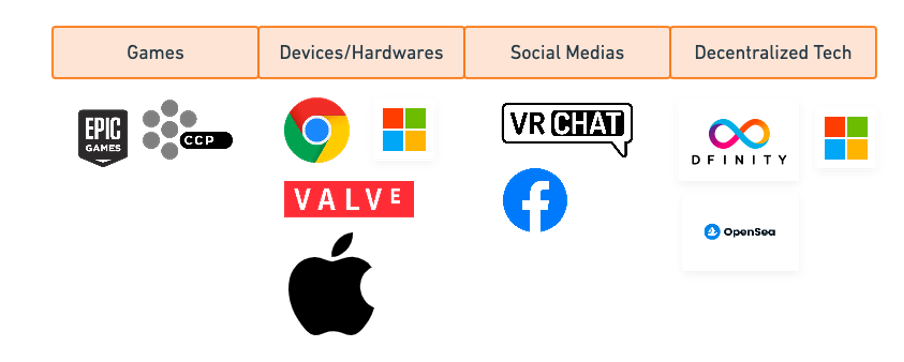
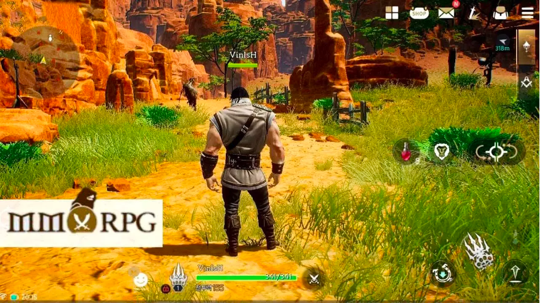
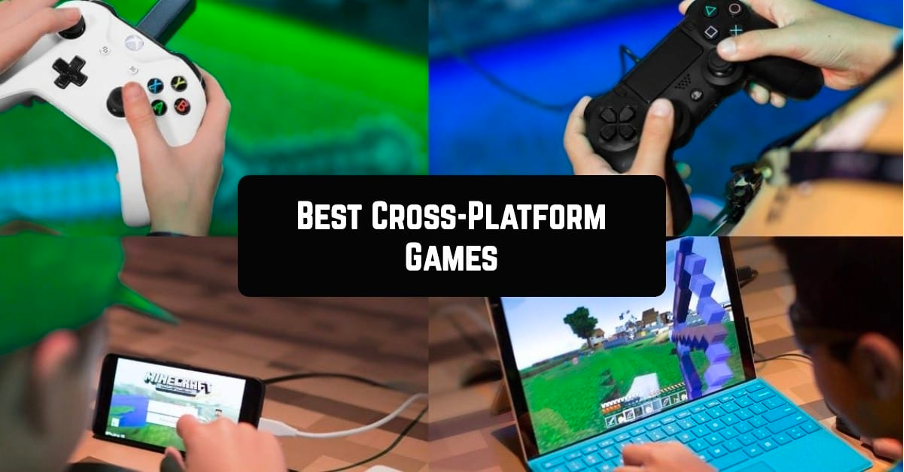
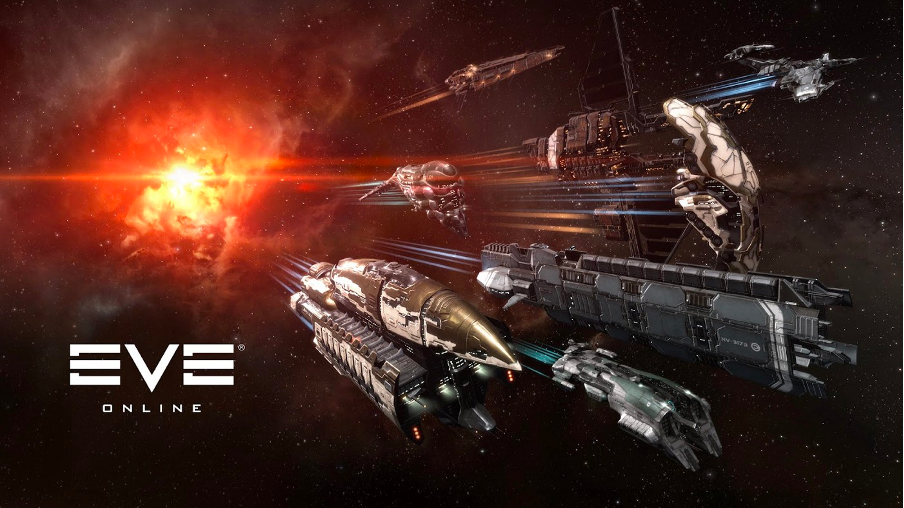
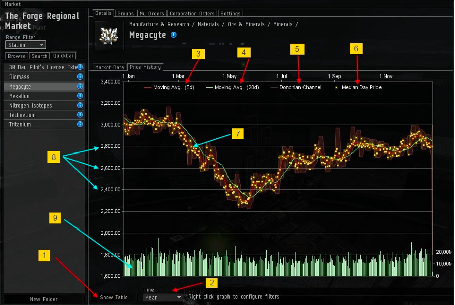

# A Glance into the Metaversity
### *The importance of decentralization*

## Introduction
The concept of Metaverse has absorbed people’s attention for a long time. The current picture of the Metaverse was mostly created by the leading centralized enterprises, like [Facebook](http://facebook.com/), [Microsoft](https://www.microsoft.com/), and [Google](https://www.google.com/), with high-tech products in game design, wearable devices, and social media platforms. However, considering the public trust issues and potential collapse in centralized institutions, we argue that only with decentralization can the Metaverse be brought to reality.

In this article, we first analyze the current architecture of Metaverse in the centralized world and then discuss the importance of decentralization, with the problems we find in reality. We use a case study at the end of this article to demonstrate how its functionality fits the idea of Metaverse and how it can be improved with decentralized systems.

### What is Metaverse?

As the CEO of Facebook, [Mr. Mark Zukerberg](https://about.facebook.com/media-gallery/executives/mark-zuckerberg/) announced to his employees earlier this year that “What I think is most interesting is how these themes (communities, creators, commerce, and virtual reality) will come together into a bigger idea. Our overarching goal across all of these initiatives is to help bring the metaverse to life.” The idea of Metaverse, which indicates an avant-garde stage of augmented reality that integrates human community, ecosystems, and high-tech development, has caught people’s attention.

Promoted by the great pandemic of COVID-19, the importance of social media and online platforms has been magnified with people’s realization of the indispensability of communication and economic activities. The idea of the Metaverse then jumped out, saying what if human beings can be supported on any online platform one day? This idea proposes a sci-fi-like future stage where people are living frictionlessly in both the digital virtual world and reality. And the implementation can be supported by any mobile terminal. Nowadays, many industrial pioneers are building approaches with high-tech development.

### How does Metaverse be implemented and applied?

*Figure 1: Several current projects supporting Metaverse (created by Whimsical).*

The current picture of the Metaverse is discrete. Many leading enterprises are developing [VR](https://en.wikipedia.org/wiki/Virtual_reality)/[AR](https://en.wikipedia.org/wiki/Augmented_reality)/[MR](https://en.wikipedia.org/wiki/Mixed_reality) technologies or applying the idea of partial metaverse to their products. The projects can be constructed into four categories: Games, Devices/Hardware, Social media, and decentralized technologies.

#### 1. The Online Games: An Immersive environment

*Figure 2: MMORPG*

Online Games are the most mature applications that have elements of the Metaverse. Online games are comprehensive platforms that enable the following characters.

1. Users are able to have virtual identities or avatars. Compared with reality, online games provide opportunities for people to hide their real identities and use digital avatars to represent themselves. The concealment of participants’ identities promotes trust-building in the large social network and promotes personal data-preserving.

*Figure 3: [Cross-Platform Game](https://freeappsforme.com/cross-platform-pc-android-ios-games/)*

2. Cross-platform experiences. The globalization of human culture and data sharing requires high, capable cross-platform applications. Some of the online games are accessible to many platforms like smartphones, [Switch](https://www.nintendo.com/switch/), desktop computers, and [game consoles](https://en.wikipedia.org/wiki/Video_game_console).
3. Users can build their own communities for socialization. Also, some games have fixed or open business models for financial usage.

#### 2. The Devices/Hardware:

The hardware is currently wearable devices like glasses. They have evolved from simple 3D glasses to MR (mixed reality) glasses which support reflecting virtual stuff into reality. For example, [Microsoft HoloLens](https://www.microsoft.com/en-us/hololens) supports the interaction between virtual reality and the real world by gestures and voices. For example, people can pick up a virtual item with real actions in a real environment by wearing a pair of them.

#### 3. The Social Media

Instead of communication with real identities, the social media in the Metaverse allow users to create and customize avatars for communication. They are able to hide their real identities, and virtual communication is one of the essential elements of the Metaverse.

#### 4. Decentralized Technologies

Although the current architecture for the realization of the Metaverse seems to be concrete, we argue that only with decentralized technologies and distributed systems can the world finally reach the successor of the Metaverse.

The limitations of the traditional centralized industrial architectures are obvious: the risks of privacy-preserving and the information collapse with data loss problem. Under the scenario that users’ information is collected with the central institution, the development of the centralized market will be limited with the trust problem.

The decentralized technologies, which utilize the architecture of the distributed networking system, have supported the construction of FinTech with various kinds of decentralized applications (DApps), new trading modes, and assets authentications. With its distributed ledger system and the open-source networking, the trust problem would be easily dealt with in the algorithm operation.

## Technical System

### Why is it so important to have decentralization: DApp?

People keep doubting the concept of “decentralization”: why do we really need it? Is decentralization necessarily good? Do we need to decentralize everything?

In the Internet sector, these questions are even more pronounced. With the development of blockchain technology, the Internet is going through a “decentralization frenzy”. Every day, whether necessary or not, new and exciting DApps are being released on the Internet. But do these apps really need decentralization and what on earth are the reasons why we need DApps?

The reasons why we need DApps can be summed up in two simple words: **trust** and **risk**.

#### A platform you can trust

“Trust” plays an essential role in almost all applications because it is closely related to two perspectives: the accessibility of the user profile and the administration of user assets.

The loss of trust in a centralized world may represent the loss of accessibility of personal identity in the digital world. When you use a password to manage your personal account in an application, the loss of your password may deny your personal identity online. And you need to trust the company that developed the app to keep your passwords safe from being leaked or used for other commercial purposes.

The failure in trust may also represent the loss of administration of your personal assets. You open an account with a bank to deposit money based on your trust in the bank’s credibility, but an accidental bankruptcy may destroy the security of a large part of your property.

This is where decentralized technology comes into play. A decentralized system, or app, is usually transparent and open. All operations made by the platform are executed according to clear rules, and any transactions on the platform are confirmed by all users. Unlike centralized applications, there is no single “administrator” with absolute power on a decentralized platform. Ideally, when you deposit your entire savings into a decentralized bank, you don’t have to worry about the platform misappropriation or embezzling your funds at will, or the platform administrator running away, as long as you keep your account address safe.

#### A platform with little collapse risk

The second important metric for applications or platforms is risk. The potential risk may exist in the collapse of a platform.

Let’s go back to the example of banks. The biggest potential risk that a user will bear for any platform is the closure or collapse of the platform. The collapse of a platform means that the user will lose all assets and rights on that platform, relationships, information, etc. This is nothing but catastrophic for large applications such as social networks or asset management platforms. At the level of platform collapse risk, decentralized platforms represent an unparalleled advantage compared to centralized platforms. Due to their decentralized nature, they are more tolerant of single or partial node crashes, and only a majority of nodes across the network crashing simultaneously will put the platform at risk of collapse, which has a very low probability of happening.

## Case Study: EVE Online

Although giant companies nowadays always keep talking about making the Metaverse a reality, it is still hard to find a single platform or a game that satisfies people’s expectation of a true “Metaverse”. However, it is still possible to find a good “mimic” of a Metaverse — introducing the [EVE Online](https://www.eveonline.com/).

### Overview

*Figure 4: [EVE Online](https://www.ccpgames.com/news/2017/eve-online%27s-new-%27arms-race%27-update-massively-expands-gameplay-experience)*

EVE Online is not a very popular game compared to [Fortnite](https://www.epicgames.com/fortnite/en-US/home). EVE Online was released in North America and Europe in May 2003 and is a space-based, persistent world [MMORPG](https://en.wikipedia.org/wiki/Massively_multiplayer_online_role-playing_game) developed and published by [CCP Games](https://en.wikipedia.org/wiki/CCP_Games).

### A Comprehensive Economic System

The economic system in EVE Online is close to the free market in reality. There are different “galaxies” in EVE, and most of them have independent “market” space stations for trading. In the marketplace, players can trade items through an [order book](https://www.investopedia.com/terms/o/order-book.asp). The division of labor in the game is sophisticated. There are players who specialize in manufacturing or commerce in the game, some focus on obtaining raw materials from the NPC, some produce primary or secondary products from raw materials, and some buy products at low prices and sell them at higher prices in other places, and more. Besides, prices of all items in the market are not determined by the system, but by the [price mechanism](https://economictimes.indiatimes.com/definition/price-mechanism). The freedom of the economic system also causes problems of [monopoly](https://en.wikipedia.org/wiki/Monopoly), that is, there are groups in the market that take advantage of low prices to monopolize the sales of a certain item.

*Figure 5: [Market in EVE](https://www.vahrokh.com/2011/12/how-to-read-eve-market-charts/2/)*

### EVE Online and the Real World

The game publisher did not link the game with the real world publicly. However, within the player community, the in-game currency, ISK, tends to have a relatively stable exchange rate with the fiat currency. Players can pay money in the real world on some unofficial platforms to buy game coins, which have given rise to players and even companies that specialize in making a living from playing EVE Online. These companies use powerful management systems to plan the production and sale of in-game resources and information advantages to earn large amounts of in-game currency and convert it to fiat currency.

### Still a Long Way to Metaverse

One thing to notice is that EVE Online wasn’t designed to be a Metaverse. The game’s more than a decade of operation and the extremely loyal player base has allowed it to develop its characteristics as a Metaverse game. Over time, the primary rules by which EVE Online operates have shifted from rules set by the game itself, such as quests provided by NPCs, to “unspoken rules” developed by the player community itself.

### What Makes EVE Online Like a Metaverse?

Like what people expect a Metaverse to have, EVE Online does not limit the player’s action. The game allows players to develop their own gameplay as long as there is a consensus among player communities. For example, the diplomatic system in EVE Online. In the basic rules of the game, if a corp is defeated, the victorious have the right to claim territories of the defeated. However, in the actual gameplay, sometimes both sides will usually send diplomats to negotiate and determine some other terms instead of a simple territorial distribution. This level of freedom has allowed EVE Online to develop so many Metaverse features today.

### And What Does Not?

Although EVE Online has many innovative features, there is still a huge gap between it and a real Metaverse. To get closer to the Metaverse, the EVE Online still has to overcome many limitations.

EVE Online is being operated by a single company and running on centralized servers. This means that the operator has absolute control over the user data and other information within the game. And, unlike the current blockchain-based games, operators can change the rules and content of the game at will. Unlike blockchain, in terms of trust-building, EVE Online relies heavily on the reputation of the game operator, rather than on the nature of the game rules themself. Therefore, if one wants to create similar games on the blockchain, the establishment of high-efficiency trust mechanisms will be one of the most engineered parts.

Another huge difference between EVE Online and blockchain-based games is its currency mechanism. The currency in EVE Online is just a virtual number, and the transaction of goods is essentially a direct change to the user’s wallet information, without the so-called “transaction” process. This leads to potential property security risks. A blockchain-based transaction system is necessary if we want to build the Metaverse in the future, using EVE Online as a blueprint.

### Potentials

However, with many of today’s new technologies, especially those regarding decentralization, the EVE Online still has a lot of room for improvement, bringing it closer to a full Metaverse.

First, decentralized technology is one of the excellent solutions to the trust problem. As mentioned before, if there are administrators with absolute power on a platform, the users’ trust will cause a problem when the volume of the platform reaches a certain level, preventing users from investing more of their resources, limiting the platform’s continued expansion. If the entire platform were to be decentralized, this would re-establish users’ trust in EVE Online and make them feel more comfortable investing a larger part of their lives on the platform.

Along with the introduction of decentralization, many of today’s blockchain technologies were also able to be brought in. One possible improvement is to integrate the NFT system. The integration of NFT will further bring the in-game economic system closer to the real one, further stimulating the market.

## Relevant Materials

Please note that we don’t include a reference list in our Medium post. If you want to cite a source in your article, please use the in-text citation for it; else if you want to explain something explicitly (e.g., jargon, definitions, etc.), please include them in this relevant material part.

**Example:**

inline:

Lorem ipsum dolor sit amet, consectetur adipiscing [1] elit…

in the relevant list:

[1] adipiscing

Etiam aliquam vel ipsum eu vestibulum. Vestibulum nec dolor quis quam sagittis auctor. Phasellus cursus sit amet nibh quis lacinia. Vestibulum dictum leo dolor

[[name-of-source](https://some.link)]

## About the Authors

### Xinyu Tian

*Figure 6: Xinyu Tian*

Xinyu Tian is a junior student majoring in Data Science at Duke Kunshan University. She is a full admission scholarship recipient and was supported by the 2021 Summer Research Scholarship. She is an interdisciplinary researcher with her passion and research experiences in Machine Learning, Big Data, FinTech, DeFi, and Game Theory. She is also the Chair of Communication in SciEcon CIC, supporting the pioneering SciEcon publications and assisting the SciEcon AMA program.

Contact her on [LinkedIn](https://www.linkedin.com/in/xinyu-tian-1777aa203/).

### Zesen Zhuang

*Figure 7: Zesen Zhuang*

Zesen Zhuang is one of the active members in SciEcon NFT research lab, as well as a junior student at Duke Kunshan University majoring in Data Science. He has a solid foundation in Computer Science and excels in Data Science courses. His areas of interest include reinforcement learning and algorithmic trading. He is working under the guidance of Prof. Luyao Zhang on the combined application of algorithmic trading and reinforcement learning. He is also involved in several projects at SciEcon CIC, for which he provides core technical support. He is the Chair of Technology Development at SciEcon CIC, working on exploring the possibilities of decentralized networks.

**Project Lead: Prof. Luyao Zhang**

## Acknowledgements

Associate Editor: Xinyu Tian

Chief Editor: Prof. Luyao Zhang

Design: Yixuan Li

